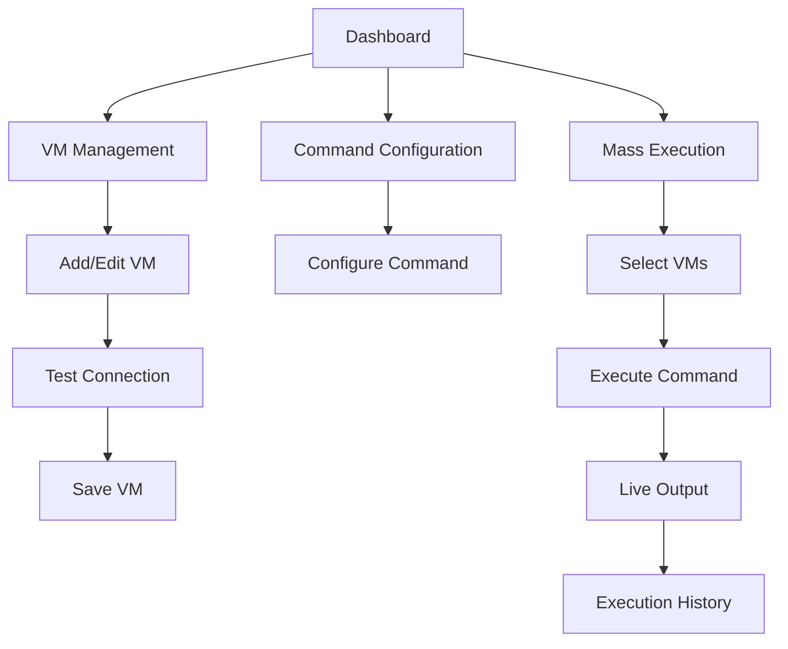

## 1. Product Overview
A web-based SSH client manager that allows users to manage multiple VM credentials and execute commands across multiple servers simultaneously. This tool solves the problem of manually SSHing into multiple VMs to restart services like FreeSWITCH by providing a centralized interface for mass command execution.

Target users: System administrators and DevOps engineers who manage multiple VMs and need to execute repetitive commands across them.

## 2. Core Features

### 2.1 User Roles
| Role | Registration Method | Core Permissions |
|------|---------------------|------------------|
| Admin User | Local authentication | Full access to VM management, command execution, and settings |
| Viewer | Read-only access | View VM status and execution logs only |

### 2.2 Feature Module
The SSH Client Manager consists of the following main pages:
1. **Dashboard**: Overview of all VMs, quick stats, and recent executions.
2. **VM Management**: Add, edit, delete, and list VM credentials with connection testing.
3. **Command Configuration**: Configure and save custom commands for execution.
4. **Mass Execution**: Select multiple VMs and execute commands with live output monitoring.
5. **Execution History**: View past command executions with logs and status.

### 2.3 Page Details
| Page Name | Module Name | Feature description |
|-----------|-------------|---------------------|
| Dashboard | VM Status Overview | Display total VMs, active connections, recent executions. |
| Dashboard | Quick Actions | Quick access to add VM, execute command, view logs. |
| VM Management | VM List | Show all VMs with IP, username, connection status. |
| VM Management | Add/Edit VM | Form to input IP, username, password/SSH key, nickname. |
| VM Management | Connection Test | Test SSH connection before saving VM credentials. |
| VM Management | Bulk Operations | Select multiple VMs for deletion or export. |
| Command Configuration | Command Editor | Text area to input and save custom commands. |
| Command Configuration | Command Templates | Pre-defined templates for common operations. |
| Command Configuration | Command Validation | Basic syntax checking and validation. |
| Mass Execution | VM Selection | Multi-select checklist of available VMs. |
| Mass Execution | Execution Mode | Choose between parallel or sequential execution. |
| Mass Execution | Live Output | Real-time display of stdout/stderr for each VM. |
| Mass Execution | Progress Tracking | Show execution progress, success/failure status. |
| Mass Execution | Execution Control | Pause, resume, or cancel running executions. |
| Execution History | History List | Table showing past executions with timestamp, VMs, command. |
| Execution History | Log Viewer | Detailed view of execution logs for each VM. |
| Execution History | Export Logs | Download execution logs as text files. |

## 3. Core Process
**VM Setup Flow**: User navigates to VM Management → Adds new VM with credentials → Tests connection → Saves VM → VM appears in dashboard.

**Command Execution Flow**: User selects VMs from dashboard → Configures or selects command → Chooses execution mode (parallel/sequential) → Starts execution → Monitors live output → Views results in history.

## 4. User Interface Design

### 4.1 Design Style
- **Primary Colors**: Dark blue (#1e40af) for headers, green (#10b981) for success states, red (#ef4444) for errors
- **Button Style**: Rounded corners with hover effects, primary actions in blue, secondary in gray
- **Font**: Inter font family, 14px base size, clear hierarchy with font weights
- **Layout**: Card-based design with consistent spacing, sidebar navigation
- **Icons**: Heroicons for consistent iconography, status indicators with colors

### 4.2 Page Design Overview
| Page Name | Module Name | UI Elements |
|-----------|-------------|-------------|
| Dashboard | VM Status Cards | Grid layout showing VM count, active connections, success rate with icon indicators. |
| Dashboard | Recent Executions | Table with striped rows, timestamp, command preview, status badges. |
| VM Management | VM Table | Sortable table with IP, nickname, status dot indicator, action buttons. |
| VM Management | Add VM Form | Modal with form fields, password visibility toggle, test connection button. |
| Mass Execution | VM Selection | Scrollable checklist with select all/none buttons, VM grouping. |
| Mass Execution | Output Console | Monospace font terminal-style output with color coding for errors/success. |
| Execution History | History Table | Expandable rows showing summary and detailed logs, search and filter options. |

### 4.3 Responsiveness
Desktop-first design with mobile adaptation. Main interface optimized for desktop use given the complexity of managing multiple VMs. Mobile view provides basic VM status checking and simple command execution.

### 4.4 Security Considerations
- SSH credentials stored locally in encrypted format
- No credentials transmitted over network after initial setup
- Session timeout for inactive users
- Audit logging for all command executions