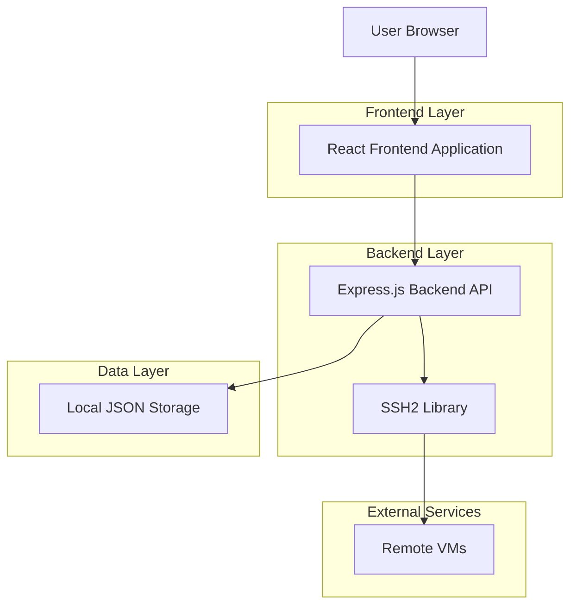
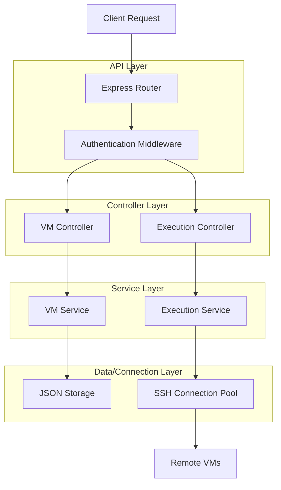
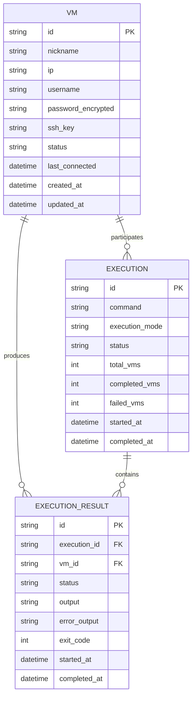

## 1. Architecture Design



## 2. Technology Description

- **Frontend**: React@18 + tailwindcss@3 + vite
- **Initialization Tool**: vite-init
- **Backend**: Node.js + Express@4
- **SSH Handling**: ssh2 library for secure SSH connections
- **Storage**: Local JSON file for VM credentials and settings
- **Real-time Communication**: WebSocket for live command output

## 3. Route Definitions

| Route | Purpose |
|-------|---------|
| / | Dashboard page, main overview of VMs and recent executions |
| /vms | VM management page, list and manage VM credentials |
| /vms/new | Add new VM form |
| /vms/edit/:id | Edit existing VM credentials |
| /commands | Command configuration page |
| /execute | Mass execution page for running commands on multiple VMs |
| /history | Execution history page with logs |
| /api/vms | API endpoint for VM CRUD operations |
| /api/commands | API endpoint for command management |
| /api/execute | API endpoint for command execution |
| /api/history | API endpoint for execution history |
| /ws/execute | WebSocket endpoint for real-time execution output |

## 4. API Definitions

### 4.1 VM Management APIs

**Get All VMs**
```
GET /api/vms
```

Response:
```json
{
  "vms": [
    {
      "id": "vm-123",
      "nickname": "Production Server 1",
      "ip": "192.168.1.100",
      "username": "admin",
      "connectionStatus": "connected",
      "lastConnected": "2024-01-15T10:30:00Z"
    }
  ]
}
```

**Create VM**
```
POST /api/vms
```

Request:
```json
{
  "nickname": "Production Server 1",
  "ip": "192.168.1.100",
  "username": "admin",
  "password": "encrypted_password",
  "sshKey": "optional_ssh_key"
}
```

**Test VM Connection**
```
POST /api/vms/test
```

Request:
```json
{
  "ip": "192.168.1.100",
  "username": "admin",
  "password": "encrypted_password"
}
```

### 4.2 Command Execution APIs

**Execute Command on Multiple VMs**
```
POST /api/execute
```

Request:
```json
{
  "vmIds": ["vm-123", "vm-456"],
  "command": "sshpass -p 'password' ssh -t user@ip \"echo 'password' | su -c 'cd /usr/local/freeswitch/bin/ && pkill -9 freeswitch && ./freeswitch'\"",
  "executionMode": "parallel"
}
```

Response:
```json
{
  "executionId": "exec-789",
  "status": "started",
  "totalVMs": 2,
  "startedAt": "2024-01-15T10:35:00Z"
}
```

**Get Execution Status**
```
GET /api/execute/:executionId/status
```

Response:
```json
{
  "executionId": "exec-789",
  "status": "running",
  "progress": {
    "completed": 1,
    "total": 2,
    "failed": 0
  },
  "results": [
    {
      "vmId": "vm-123",
      "status": "success",
      "output": "Command executed successfully",
      "exitCode": 0
    }
  ]
}
```

## 5. Server Architecture Diagram



## 6. Data Model

### 6.1 Data Model Definition



### 6.2 Data Definition Language

**VMs Table (vms.json)**
```json
{
  "vms": [
    {
      "id": "vm-123",
      "nickname": "Production Server 1",
      "ip": "192.168.1.100",
      "username": "admin",
      "password": "encrypted_password_string",
      "sshKey": null,
      "status": "active",
      "lastConnected": "2024-01-15T10:30:00Z",
      "createdAt": "2024-01-01T00:00:00Z",
      "updatedAt": "2024-01-15T10:30:00Z"
    }
  ]
}
```

**Executions Table (executions.json)**
```json
{
  "executions": [
    {
      "id": "exec-789",
      "command": "sshpass -p 'password' ssh -t user@ip 'command'",
      "executionMode": "parallel",
      "status": "completed",
      "totalVMs": 2,
      "completedVMs": 2,
      "failedVMs": 0,
      "startedAt": "2024-01-15T10:35:00Z",
      "completedAt": "2024-01-15T10:37:00Z"
    }
  ]
}
```

**Execution Results Table (execution_results.json)**
```json
{
  "executionResults": [
    {
      "id": "result-456",
      "executionId": "exec-789",
      "vmId": "vm-123",
      "status": "success",
      "output": "FreeSWITCH restarted successfully",
      "errorOutput": "",
      "exitCode": 0,
      "startedAt": "2024-01-15T10:35:01Z",
      "completedAt": "2024-01-15T10:35:30Z"
    }
  ]
}
```

## 7. Security Implementation

### 7.1 Credential Encryption
- Passwords encrypted using AES-256 encryption with user-specific key
- SSH keys stored with file system permissions (600)
- No plaintext passwords in logs or responses

### 7.2 SSH Connection Security
- Use SSH2 library for secure connections
- Support both password and SSH key authentication
- Connection timeout and retry mechanisms
- Connection pooling to avoid resource exhaustion

### 7.3 Execution Safety
- Command timeout configuration (default 5 minutes)
- Maximum concurrent connections limit
- Resource usage monitoring
- Safe command validation and sanitization